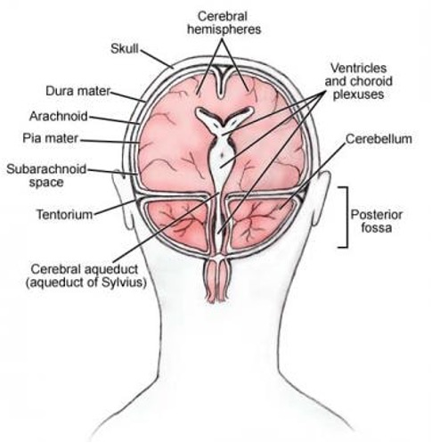
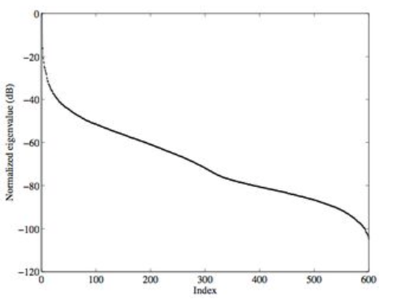
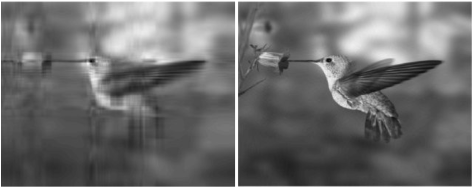
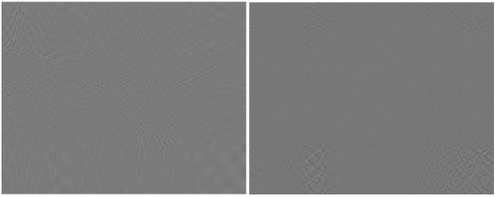
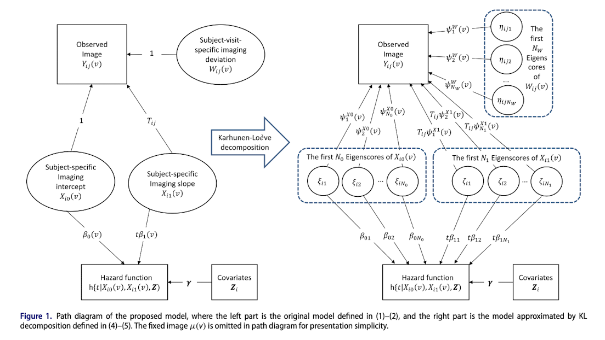
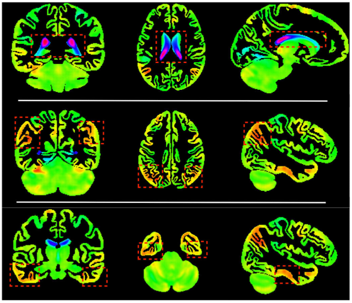

```{r setup, include=FALSE}
knitr::opts_chunk$set(echo = FALSE)
```


## Background

**Alzheimer’s disease (AD)**

- Characterized by cognitive deficits
- Gradual changes in cognition occurs with normal aging, so it’s difficult to identify during pre-clinical phase and distinguish from mild cognitive impairment (MCI).
- As the disease progresses, the decline in cognition accelerates.
- Little is known when these changes in cognition occurs or when they are distinguishable from normal aging.
- Detection of pre-clinical dementia is important for treatment and outcomes.

## Background

```{r, echo = FALSE, out.width="50%", out.height="50%", out.extra='style="float:right; padding:10px"'}

```

- There is evidence to indicate that dynamic changes of specific brain regions over time may be likely associated with AD progression.

- For example, subjects with MCI to AD conversion appear to be associated with increasingly enlarged ventricles across time, whereas subjects who did not progress to AD remained nearly unchanged.

## Research Objectives

- Investigate the association between the longitudinal feature of MRI images and time to AD.

- Develop a prognostic model for clinicians to plan interventions based on the history of patients’ MRI images.

## Data

- Alzheimer’s Disease Neuroimaging Initiative (ADNI) study
  - Overall objective of detecting AD at the earliest stage and identifying ways to track the disease progression.

- Recruited subjects aged 55 to 90 and collected their imaging, genetic, clinical, cognitive, and biochemical characteristics across the long-term study.

- Subjects could develop AD during the study period, so time-to-AD information was also collected.

## MRI Data

- The preprocessed magnetic resonance imaging (MRI) data were obtained for each participant at several time points.

- The image data for a given individual at a given time point can be stored in a voxel (i.e., 3D array structure) of dimension $p= p_1  \times p_2  \times p_3$

- Voxel dimensions are the same across subjects and visits.

- Images are voxel-wise stored, i.e., unfolded into a $p\times1$ vector containing the voxels in a particular order, where the order is preserved across all subjects and visits.

## Complexities

- **Joint modeling**
  - Need model that incorporates dynamic variations/changing patterns of brain MRI images over time along with time-to-AD event information.

- **Ultrahigh-dimensional images**
  - MRI images are of dimension 133 × 170 × 129, so $p$=2,916,690
  - Current joint modeling approaches have not considered settings when the longitudinal observations are Ultrahigh-dimensional.

- **Conducting dynamic prediction**
   - Existing prediction procedures only accommodate longitudinal low-dimensional observations.


## Joint Modeling

- The general concept is rather simple:
  1. We have longitudinal data
  2. We have survival data
  3. We want to model them in a way that the models borrow information from one another
- Longitudinal data can inform survival outcome
  - e.g. Increasing size of ventricles and the time to AD
- Survival can inform longitudinal data by accounting for informative censoring
  - e.g. Missed visits due to progression to AD or death likely provides information on potentially unobserved trajectories of changes in the ventricles
  
## Survival Data Background {.smaller}

- What makes survival data unique is *Censoring*
- *Censoring* occurs when we do not observe a subject until they experience the event of interest
  - May occur due to study ending, death due to another cause, or unrelated circumstances
  
**Notation:**
  
- Let $T_i^*$ be the actual survival time, which may or may not be observed due to censoring
  - The reason for $^*$ is to distingish this time from the measurement times in the longitudinal data
- Let $C_i$ be the censoring time
- Define $R_i$ = $min(T_i^*, C_i)$, we call this the *observed time*
- Finally, define $\Delta_i = I(T_i^* \leq C_i)$ to be the indicator of if the event was observed or not

## Modeling Survival Data {.smaller}

- As the name implies, survival data depends on the survival distribution (S(t))
- However, usually, the surivial function is defined in terms of a hazard function
- The hazard function represents the instantaneous failure rate at time $t$.
- More specifically, it is the probability that a subject will fail at time $t$ given that $T^* > t$
- $h(t) = \lim_{\delta \rightarrow 0} \frac{P(t + \delta  > T^* > t | T > t)}{\delta}$
- $h(t)$ relates to $S(t)$ by $h(t) = \frac{f(t)}{S(t)}$ where $f(t) = -\frac{d}{dt}S(t) =\frac{d}{dt}F(t)$.
- The hazard is often modeled using the Cox PH model:

$$
h(t|x) = h_0(t)exp \Big[Z_i \gamma \Big]
$$

- Where $x$ at this point is an arbitrary stand in to represent "data"
- The above included only constant covariates

## Time Dependent Covariates {.smaller}

- Consider the following extension:

$$
h(t|x) = h_0(t)exp \Big[\boldsymbol{X}_i(t)\boldsymbol{\beta} + Z_i \gamma \Big]
$$

- This indicates that $\boldsymbol{X}$ may be time dependent
- "May" is critical for this presentation, $\boldsymbol{X}(t)$ is currently an abuse of notation
- Purely used to align with how the notation is presented in the paper.

## Back to Longitudinal {.smaller}

- Now that we have an idea of the form of the survival model, how will we model the images?
- Model $Y_{ij}$ with random intercept and slope model
- measured at times $t_{ij}$

$$
Y_{ij} = \mu_i + X_{i0} + X_{i1}T_{ij} + W_{ij} \\
$$

- $Y_{ij}$ is the value actually observed at time $t_{ij}$
- $X_{i0}$ is a random intercept, and $X_{i1}$ a random slope
- $W_{ij}$ is random normal error representing individual-visit variation
- Note that the terms in the model above can be generalized 

## Extension to Imaging Data {.smaller}

- First, let $\mu_i = \mu$

$$
Y_{ij} = \mu + X_{i0} + X_{i1}T_{ij} + W_{ij} \\
$$

- Then note that we can model each voxel at a given visit $j$:

$$
Y_{ij}(v) = \mu(v) + X_{i0}(v) + X_{i1}(v)T_{ij} + W_{ij}(v) \\
$$
- This extension is of course not trivial, as this is now a functional mixed effects model

## Combining Models: The Survival model {.smaller}

- Recall the form presented previously:

$$
h(t|x) = h_0(t)exp \Big[\boldsymbol{X}_i(t)\boldsymbol{\beta} + Z_i \gamma \Big]
$$

- We will leave the fixed covariates as is, however, we will include the **REs** from the longitudinal model above as time varying covariates
- With that said, survival is a univariate outcome, and we have brain scan data that is of much higher dimension
  - Integrate over this information

$$
h(t|X_{i0}(v), X_{i1}(v), \boldsymbol{Z}_i) = h_0(t) exp \Big[ \int_{V} \lbrace \beta_0(v)X_{i0}(v) + t\beta_1(v)X_{i1}(v)\rbrace dv + \gamma'Z_i \Big]
$$

## The Likelihood {.smaller}

- Okay, great, but the above seems like a bit of a simplification, how do we actaully fit this model?
- Let $\boldsymbol{\theta}$ be the vector containing all unknown parameters

$$
p(\boldsymbol{R}, \boldsymbol{\Delta}, \tilde{\boldsymbol{Y}}, \boldsymbol{Z} | \boldsymbol{\theta})= \prod_{i=1}^I \int p(R_i, \Delta_i | \boldsymbol{X}_i(v), \boldsymbol{Z}_i, \boldsymbol{\theta})p(\boldsymbol{Y}_i|\boldsymbol{X}_i(v), \boldsymbol{\theta})p(\boldsymbol{X}_i(v)|\boldsymbol{\theta})d\boldsymbol{X}_i(v) 
$$

- In general, the arrival at a single likelihood is not trivial 


## Estimation {.smaller}

- The route of estimation largely depends on the data at hand and the end goal
- One simple way to go about this is to use a two stage approach:
  1. Estimate the longitudinal model
  2. Use estimates from (1) in the survival model
- However this has been shown to lead to considerable bias when measurement error in the longitudinal observations are large
- Many approaches use an EM algorithm adapted to the specific problem at hand
- Other approaches have taken a Bayesian approach and developed MCMC algorithms
- Given the complexity of the problem being solved here, the authors adopted a Bayesian approach
- In the absence of association between longitudinal and event time data, the joint analysis should recover the same results as if the analyses were done speratly.


## PCA and Image Dimension Reduction - Basic Idea {.smaller}

- The main idea is to use PCA to obtain low rank approximations of images.

```{r, echo = FALSE, out.width="50%", out.extra='style="float:right; padding:20px"'}

```

- Take for example this image:
  - This gray scale image is a 648 $\times$ 600 image (i.e., p = 388,800)

## PCA and Image Dimension Reduction - Basic Idea {.smaller}

```{r, echo = FALSE, out.width="40%", out.extra='style="float:right; padding:20px"'}

```

- Implement PCA using singular value decomposition (SVD).

- Plot normalized eigenvalue by singular value (in this case there are 600 total singular values).

- After about the first 20−25 singular values, it falls off and the bulk of it is so low, that any information it contains is negligible.

## PCA and Image Dimension Reduction - Basic Idea {.smaller}

- Image recreated by using the first 10 singular values (left) vs. first 50 (right)
- Essence of the image is basically captured in just 10 singular values out of a total of 600.
- Increasing to the first 50 singular values shows that the picture is almost exactly reproduced (to the human eye). Furthermore, only using the first 50 singular values essentially cuts down the dimensions of the original image by 84%, while still preserving almost all the information from the original image.

```{r, echo = FALSE,  out.width="70%", fig.align='center'}

```

## PCA and Image Dimension Reduction - Basic Idea {.smaller}

- Looking at the next 100 singular values (left), we see some fine structure, especially around the feathers, which are generally indistinguishable to the naked eye.
- The smallest 300 singular values (right) convey no real information, most likely just noise. 

```{r, echo = FALSE,  out.width="70%", fig.align='center'}

```

## KL Decomposition {.smaller}

- Let $\mathrm{\bf{K}}^{X0}(v_1, v_2), \mathrm{\bf{K}}^{X1}(v_1, v_2), \text{ and } \mathrm{\bf{K}}^{W}(v_1, v_2)$ denote the covariance operator of $X_{i0}(v), X_{i1}(v)$, and $W_{ij}(v)$, respectively.

- Based on KL decomposition, we have:
  - $X_{i0}(v) = \sum^{\infty}_{k=1} \xi_{ik} \psi_{k}^{X0}(v)$
  - $X_{i1}(v) = \sum^{\infty}_{l=1} \zeta_{il} \psi_{l}^{X1}(v)$
  - $W_{ij}(v) = \sum^{\infty}_{m=1} \eta_{ijm} \psi_{m}^{W}(v)$ 
  
- Where,  $\psi_{k}^{X0}(.), \psi_{l}^{X1}(.),$ and $\psi_{m}^{W}(.)$ are the eigenfunctions of $\mathrm{\bf{K}}^{X0}, \mathrm{\bf{K}}^{X1}$, and $\mathrm{\bf{K}}^{W}$, respectively.  Additionally, $\xi_{ik}, \zeta_{il},$ and $\eta_{ijm}$ are their corresponding eigenscores with:
   - $E(\xi_{ik}) = E(\zeta_{il}) = E(\eta_{ijm}) = 0$
   - $Var(\xi_{ik}) = \lambda_k^{X0}$ 
   - $Var(\zeta_{il}) = \lambda_l^{X1}$ 
   - $Var(\eta_{ijm}) = \lambda_m^{W}$

## KL Decomposition {.smaller}

Recall the longitudinal model described earlier:

$$
Y_{ij}(v) = \mu(v) + X_{i0}(v) + X_{i1}(v)T_{ij} + W_{ij}(v) \\
$$

Now it can be rewritten as 

$$
Y_{ij}(v)=\mu(v) +\sum^{\infty}_{k=1} \xi_{ik} \psi_{k}^{X0}(v) + T_{ij}\sum^{\infty}_{l=1} \zeta_{il} \psi_{l}^{X1}+\sum^{\infty}_{m=1} \eta_{ijm} \psi_{m}^{W}(v) \\
$$

The model above can be approximated by the first few coordinates (i.e., principal components) (i.e., $N_0 , N_1,$ and $N_W$) that are typically small and determined using criterion-based methods (e.g. BIC). Giving us the eigenimages (i.e., low rank approximations of images).

$$
Y_{ij}(v)=\mu(v) +\sum^{N_0}_{k=1} \xi_{ik} \psi_{k}^{X0}(v) + T_{ij}\sum^{N_1}_{l=1} \zeta_{il} \psi_{l}^{X1}+\sum^{N_W}_{m=1} \eta_{ijm} \psi_{m}^{W}(v) \\
$$

- Where the eigenscores are assumed to be normally distributed as $\xi_{ik} \sim N(0,\lambda_K^{X0})$, $\zeta_{il} \sim N(0,\lambda_l^{X1})$, and $\eta_{ijm} \sim N(0,\lambda_m^{W})$  

(Note: the normality assumption on the prior distributions of the eigenscores can be relaxed without difficulty. Other distributions with the existence of second order moments can be considered.)

## KL Decomposition {.smaller}

Recall the Cox model described earlier:

$$
h(t|X_{i0}(v), X_{i1}(v), \boldsymbol{Z}_i) = h_0(t) \exp \Big[ \int_{V} \lbrace \beta_0(v)X_{i0}(v) + t\beta_1(v)X_{i1}(v)\rbrace dv + \boldsymbol{\gamma}^\prime\boldsymbol{Z}_i  \Big]
$$
Suppose $\beta_0(v)$ and $\beta_1(v)$ can be expanded on the respective eigenfunctions $\psi_k^{X0}$ and $\psi_l^{X1}$, then $\beta_0(.)$ and $\beta_1(.)$ can also be approximated by $\sum^{N_0}_{k=1}\beta_{0k}\psi_k^{X0}(v)$ and $\sum^{N_1}_{l=1}\beta_{1l}\psi_l^{X1}(v)$. This gives us the proposed model:

$$
\begin{aligned}
h(t&|X_{i0}(v), X_{i1}(v), \boldsymbol{Z}_i) \\&= h_0(t) \exp \Big(\sum^{N_0}_{k=1}\beta_{0k}\xi_{ik}(v) + t\sum^{N_0}_{l=1}\beta_{1l}\zeta_{il}+\boldsymbol{\gamma}^\prime \boldsymbol{Z}_i  \Big)\\
&= h_0(t) \exp \Big(\boldsymbol{\beta}_0^\prime \boldsymbol{\xi}_i + t\boldsymbol{\beta}_1^\prime \boldsymbol{\zeta}_i+\boldsymbol{\gamma}^\prime \boldsymbol{Z}_i \Big)
\end{aligned}
$$

where $\boldsymbol{\beta}_0 = (\beta_{01},...,\beta_{0N_0})^\prime$, $\boldsymbol{\xi}_i = (\xi_{i1},...,\xi_{iN_0})^\prime$,
$\boldsymbol{\beta}_1 = (\beta_{11},...,\beta_{1N_1})^\prime$, and $\boldsymbol{\zeta}_i = (\zeta_{i1},...,\zeta_{iN_1})^\prime$
  
## KL Decomposition - General Idea 
  
```{r, echo = FALSE, out.width="85%", out.height="85%", out.extra='style="float:center; padding:10px"'}

```


## The Likelihood {.smaller}

- Let $\boldsymbol{D} = \lbrace \boldsymbol{R}, \boldsymbol{\Delta}, \tilde{\boldsymbol{Y}}, \boldsymbol{Z} \rbrace$
- Note that $\boldsymbol{\theta} = \lbrace \boldsymbol{\beta}_0, \boldsymbol{\beta}_1, \boldsymbol{\gamma}, \boldsymbol{\xi}_i,  \boldsymbol{\zeta}_i, \boldsymbol{\eta}_i, \boldsymbol{\lambda}_k^{X0}, \boldsymbol{\lambda}_l^{X1}, \boldsymbol{\lambda}_m^{W}, \boldsymbol{h}_g \rbrace$
- This leads to one single likelihood that can be used for fitting the model

$$
p(\boldsymbol{D} | \boldsymbol{\theta})= \prod_{i=1}^I \int \int p(R_i, \Delta_i | \boldsymbol{\xi}_i, \boldsymbol{\zeta}_i, \boldsymbol{Z}_i, \boldsymbol{\theta})p(\boldsymbol{Y}_i|\boldsymbol{\xi}_i, \boldsymbol{\zeta}_i, \boldsymbol{\theta})p(\boldsymbol{\xi}_i|\boldsymbol{\theta})p(\boldsymbol{\zeta}_i|\boldsymbol{\theta})d\boldsymbol{\zeta}_i d\boldsymbol{\xi}_i
$$

- Which does not have an explicit form

## Bayesian Details: Priors {.smaller}

**Unknown Parameters:**

$$
\begin{aligned}
\boldsymbol{\beta}_0 \sim N(\boldsymbol{0}, \sigma^2_{\beta_0}I_{N_0}) \\
\boldsymbol{\beta}_1 \sim N(\boldsymbol{0}, \sigma^2_{\beta_1}I_{N_1}) \\
\boldsymbol{\gamma} \sim N(\boldsymbol{0}, \sigma^2_{\gamma}I_{q})
\end{aligned}
$$

- The $\sigma^2$s are taken to be large when prior knowledge is not available

**Variance Components:**

For $k = 1, \ldots, N_0$, $l = 1, \ldots, N_1$, $m = 1, \ldots, N_w$,

$$
\begin{aligned}
\lambda_k^{X0} \sim IG(a_k^{X0}, b_k^{X0}) \\
\lambda_l^{X1} \sim IG(a_l^{X1}, b_l^{X1}) \\
\lambda_m^{W} \sim IG(a_m^{W}, b_m^{W}) \\
\end{aligned}
$$

- Empirical Bayes can be used to help choose hyper parameters
- For example: $a_k^{X0} \leq 0.01$, $b_k^{X0} \leq 0.01\tilde{\lambda}_k^{X0}$, where $\tilde{\lambda}_k^{X0}$ is the EB estimator

## Bayesian Details: Priors (continued) {.smaller}

**Hazard values:**

- Here the approach taken to estimate $h_0(t)$ is to treat it as a piecewise constant.

For $g = 1, \ldots, G$,

$$
h_g \sim Gamma(\alpha_{1g}, \alpha_{2g})
$$

- With $(\alpha_{1g}, \alpha_{2g})$ often set to $(0.2, 0.4)$ or $(0.5, 1)$ to result in a flat prior.

## Bayesian Details: Sampling {.smaller}


- Sampling directly from the posterior is intractable, as one might imagine
  - Mainly due to the existence of the latent variables $\boldsymbol{\xi}$ and $\boldsymbol{\zeta}$
  - Instead sampling is done for $p(\boldsymbol{\theta}, \boldsymbol{\xi}, \boldsymbol{\zeta} | \boldsymbol{D})$
- $\boldsymbol{\eta}_{ij}$ can automatically be updated: $\boldsymbol{\eta}_{ij} = (\Psi^{W'}\Psi^{W})^{-1}\Psi^{W'}(\tilde{\boldsymbol{Y}}_{ij} - \Psi^{X0}\boldsymbol{\xi}_i - T_{ij}\Psi^{X1}\boldsymbol{\zeta})$
- The full conditionals for $\boldsymbol{\xi}_i$ and $\boldsymbol{\zeta}_i$ (jointly) and $\boldsymbol{\beta}_0$, $\boldsymbol{\beta}_1$, and $\boldsymbol{\gamma}$ (jointly) are a bit unwieldy and don't follow a known distribution.
  - Required Metropolis Hastings with a multivariate normal proposal
    - Mean at the current value of the parameters of interest
    - Covariance proportional to the inverse of the fisher information of the posterior
      - Use a small variance parameter to tune acceptance rate to be approximately 35%
- The eigenscores and $h_g$ can be sampled from using Gibbs sampling
  - The full conditionals for the eigenscores ($\lambda_k^{X0}$, $\lambda_l^{X1}$, $\lambda_m^{W}$) are Inverse-Gamma
  - The full conditional for $h_g$ is Gamma
- Thus, Metropolis-Hastings within Gibbs can be used to sample from $p(\boldsymbol{\theta}, \boldsymbol{\xi},   \boldsymbol{\zeta}  | \boldsymbol{D})$

      
## Bayesian Details: Prediction {.smaller}

- Given a set of longitudinal images and baseline covariates
- Focus on the time interval $(t, t + \delta]$
- Conditional on surviving up to time $t$, the conditional probability of survival up to time $t +\delta$
- Notationally we are interested in $P(T_i^* \geq t + \delta | T_i^* > t, Y_i^t, \boldsymbol{Z}_i, \boldsymbol{D})$
- However, recall in the previous step, the posterior ($p(\boldsymbol{\theta}|\boldsymbol{D})$) was obtained.
- Thus, we can compute the above probability with the integrand: $\int P(T_i^* \geq t + \delta | T_i^* > t, Y_i^t, \boldsymbol{Z}_i, \boldsymbol{\theta})p(\boldsymbol{\theta}|\boldsymbol{D})d\boldsymbol{\theta}$
- The authors show this can be computed using Monte Carlo integration
- Predictive ability can be assessed using a time dependent AUC
  - AUC(t, $\delta$) = $P(\pi_{i_1}(t, \delta) < \pi_{i_2}(t, \delta) | \lbrace T^*_{i_1} \in (t, t + \delta] \rbrace \cap \lbrace T^*_{i_2} > t+ \delta \rbrace)$

## Simulation Summary: Simulation 1 Setup {.smaller}

- Simulate 100 datasets with images of $50 \times 50 \times 50$ and with $\mu(v) = 0$.
- In these simulations they use two different sample sizes: 300 and 500
- Generate data with each subject having 7, 8, or 9 scans over time
- Two principal components are used for the intercept and slope, and four are used for the random subject-visit deviation
- They also considered three baseline hazards (constant, linear, non-linear) and a range of censoring rates
- Evalutated Bias, RMSE, and SE

## Simulation Summary: Simulation 1 Results {.smaller}

- Simulation 1 showed that the estimation procedure was satisfactory for estimating $\boldsymbol{\beta}_0, \boldsymbol{\beta}_1$, and $\boldsymbol{\gamma}$ as well as the estimates for the eigenscores.
- They also found that performance is improved as the sample size is increased or censoring rate is decreased
- Relatively consistent across different baseline hazards
- Choice of $N_W$ hardly effects estimation of survival model 
- Use of BIC to select $N_0$ and $N_1$, (where $N_0$ = $N_1$), correctly selected 2 in 99 of the 100 simulations. 
- Each replication took about 4 and a half minutes.

## Simulation Summary: Simulation 2 {.smaller}

- Same setup as simulation 1, but focused on the comparison to the two-stage approach
- Used a constant baseline hazard.
- They also considered larger eigenscores for the subject-visit variation (1, 0.75, 0.5, 0.25)
- Found that the two stage approach tends to produce biased results that does not improve with an increase in sample size
  - Worsens with an increase in the subject-visit variation as well

## Data Analysis - Methods {.smaller}

- Applied proposed method to ADNI dataset.

- Only considered subjects who suffered from MCI at baseline and those with at least 3 longitudinal MRI scans:
339 subjects who had 3-6 follow-up visits (baseline, month 6, month 12, month 18, month 24, and month 36).

- 127 subjects experienced conversion from MCI to AD.

- Time to event was calculated as time from baseline to date of first diagnosis of AD for those that experience conversion and time from baseline to date of last visit for all others. 

- Censoring rate was approximately 62%.

- MRI data were preprocessed to a dimension of 133 × 170 × 129. 

- Considered demographic variables such as gender and whether or not the subject was married.

- Considered the APOE gene biomarker. Included indicators for one APOE allele carrier and two APOE alleles carrier.


## Data Analysis - Methods {.smaller}

- Used BIC to determine $𝑁_0,𝑁_1,$ and $𝑁_𝑤$ and assumed $𝑁_0=𝑁_1=𝑁_𝑤=𝑁$. BIC selected $𝑁=7$. Thus, the joint model with the first seven eigenimages was chosen for the analysis.

- For the baseline hazard function  they chose $𝐺=5$ and selected the cut points as the quantiles of the observed survival time. 

- Used flat priors for the hyperparamters.

- Used MCMC algorithm to collect 10,000 posterior samples after 10,000 burn-in iterations. 
  - 5.03 minutes of computation time.

## Data Analysis - Results {.smaller}

```{r, echo = FALSE, out.width="30%", out.height="50%", out.extra='style="float:right; padding:10px"'}

```

- For the imaging predictors:
  - The 1st and 5th eigenimages of random imaging intercept and the 1st eigenimage of random imaging slope exhibit significant effects on AD hazards.

- Several brain regions are detected to be highly associated with AD hazards:
  - The positive effect of “lateral ventricles” (the top row of figure) is evident, implying that the enlargement of the lateral ventricles is positively associated with the development of AD. Consistent with the previous medical studies.
  
  - In the brain regions that depict negative effects, the magnitudes of the effects of “inferior parietal lobe” ( the second row of figure) and “inferior temporal gyrus and fusiform gyrus” (third row of figure) are relatively large. This is in line with existing research which indicate that AD is negatively correlated to the volume/thickness of these regions.
 
## Data Analysis - Results {.smaller}

- For the baseline covariates:
  - Gender had a significant negative effect on AD hazards, indicating that females have a higher risk of suffering from AD than males.
  - Surprisingly the APOE gene which has been found to be an important risk factor in previous research had an insignificant effect in this study.
    - One possible explanation is that APOE gene is somehow a confounding variable between certain brain regions and the hazards of AD. 
    
## Questions

## Spectral Decomposition {.smaller}

- Spectral decomposition of $\mathrm{\bf{K}}^{X0}, \mathrm{\bf{K}}^{X1}, \text{ and } \mathrm{\bf{K}}^{W}$ needs to be constructed to derive the eigenimages shown in the model.

- Start by centering the longitudinal imaging data:
  - $\tilde{Y}_{ij}(v) = Y_{ij}(v) - \hat{\mu(v)}$, where $\hat{\mu(v)} = \frac{1}{n} \sum^I_{i=1} \sum^{J_i}_{j=1}Y_{ij}(v)$, $n = \sum^I_{i=1}J_i$, $I$ is the total number of subjects, and $J_i$ is the total number of visits for subject i.
  
- However, we run into a problem due to $\tilde{Y}_{ij}(v)$ being ultrahigh dimensional, making standard approaches for  the spectral decomposition of $\mathrm{\bf{K}}^{X0}, \mathrm{\bf{K}}^{X1}, \text{ and } \mathrm{\bf{K}}^{W}$ unfeasible. 
  - For example, with the MRI images of 133 × 170 × 129 ( $p$=2,916,690) the resulting covaraince operator $\hat{\mathrm{\bf{K}}}^{X0}$ is of dimension 2,916,690 $\times$ 2,916,690.
  
- To overcome this challenge, use singular value decomposition (SVD):
  - Let $\tilde{\mathrm{\bf{Y}}} = (\tilde{\mathrm{\bf{Y}}}_1, ..., \tilde{\mathrm{\bf{Y}}}_I)_{p \times n}$, where $\tilde{\mathrm{\bf{Y}}}_i = (\tilde{\mathrm{\bf{Y}}}_{i1},...\tilde{\mathrm{\bf{Y}}}_{iJ_i})$ is the centralized $p \times J_i$ and column $j$ for $j = 1,...,J_i$ contains the unfolded images for subject i at visit j
  - Construct the singular value decomposition (SVD) of the matrix $\tilde{\mathrm{\bf{Y}}}$  to get the best low-dimension approximation of the matrix which subsequently allows us to obtain a low-dimension representations of the covariance operator $\hat{\mathrm{\bf{K}}}^{X0}, \hat{\mathrm{\bf{K}}}^{X1}, \text{ and } \hat{\mathrm{\bf{K}}}^{W}$.


